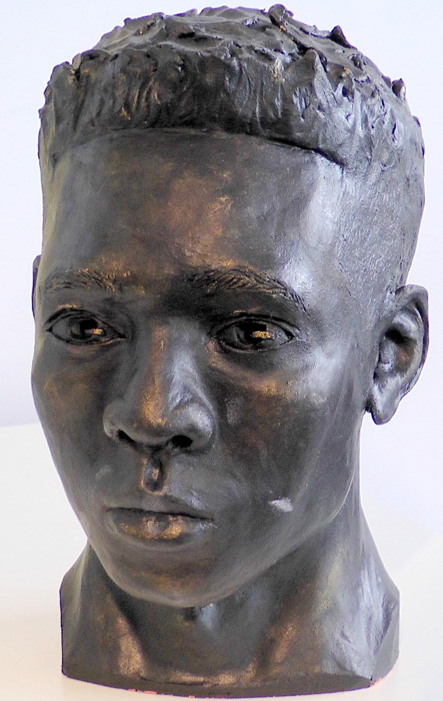

# Royal Society Exhibitions
Archive of student works (sculptute) exhibited at the Royal Society of Portrait Painters (RP) exhibition, alongside a structured development log for 2026/27 open-call submissions.

  
   
  <i>Head Clay Sculpture</i>

Following a 2025 open-call submission to the Royal Society of Portrait Painters (RP), I went to the exhibition at the Mall Galleries for a comparative exercise of the accepted artworks against my unsucessful submissions. By evaluating successful compositions and technical execution, I identified key areas for development to align my 2026/27 submissions. improvements that are already showing in my current paintings.

## 📰 Press & Media Coverage
*   **Official Feature:** [RBA (Royal Society of British Artist) - Star Students](https://theartssociety.org/arts-news-features/rba-star-students)

